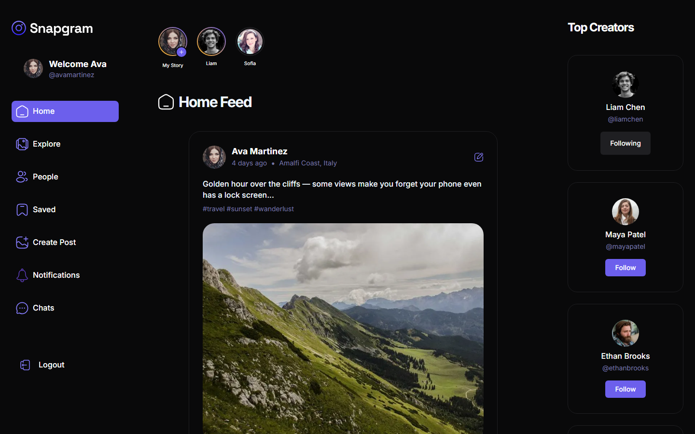
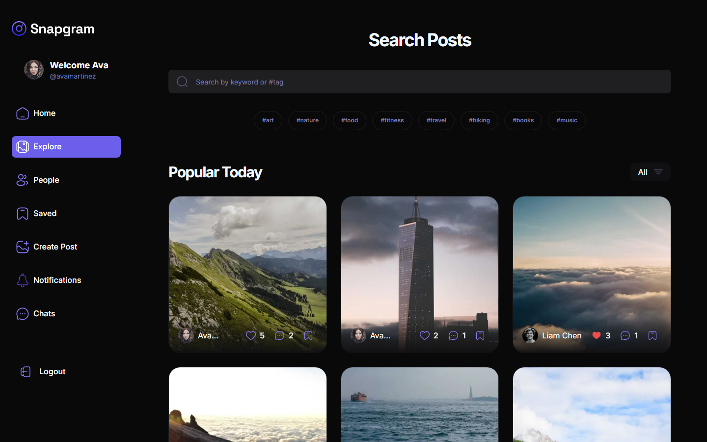
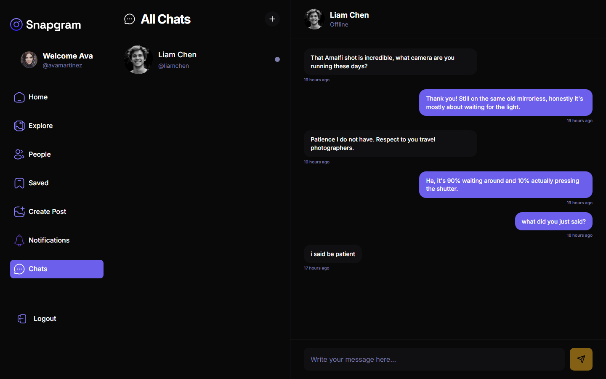
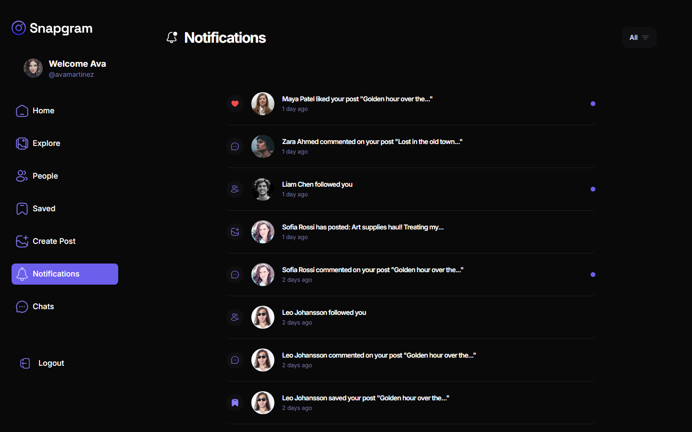

<div align="center">

# 📸 Snapgram

**A full-stack social media platform** — posts, stories, real-time chat, and a follow graph, built with a security-first, test-covered, WCAG AA–accessible engineering approach.

[](https://github.com/SaraAboElenien/snapgram-v2/actions/workflows/ci.yml)


[](LICENSE)

</div>

---

## Screenshots

<table>
<tr>
<td width="50%"><br/><sub>Home feed</sub></td>
<td width="50%"><br/><sub>Explore — tag-based search &amp; discovery</sub></td>
</tr>
<tr>
<td width="50%"><br/><sub>Real-time chat (Socket.io)</sub></td>
<td width="50%"><br/><sub>Notifications</sub></td>
</tr>
</table>

---

## Overview

Snapgram is a second-generation rebuild of a social media platform, built to demonstrate production-grade engineering practices on top of a genuinely full-featured social app — not just CRUD scaffolding. Every feature below is real and end-to-end tested, not a mock.

## ✨ Features

**Core social**
- Email-confirmed signup, JWT auth with password reset
- Posts — image upload (Cloudinary), captions, tags, location, likes, comments, saves
- Follow / unfollow graph, mutual-follow-gated features
- Explore with debounced search, popular-tag discovery, and infinite scroll
- Stories with 24-hour TTL expiry and a full "seen by" viewer list
- Real-time notifications for likes, comments, follows, new posts, and saves

**Real-time**
- 1:1 direct messaging over Socket.io, JWT-authenticated at the socket handshake
- Live presence (online/offline), scoped to mutually-followed users only

**Security & reliability**
- Rate limiting on auth endpoints, Helmet security headers, response compression
- Server-side session revocation (logout invalidates every issued token for that account)
- Structured JSON logging with per-request correlation IDs ([Pino](https://getpino.io/))
- Real-time error tracking, backend + frontend ([Sentry](https://sentry.io/))
- Cascading deletes across every relationship (no orphaned posts, comments, images, or conversations)

**Accessibility**
- WCAG 2.1 AA — verified with an automated `axe-core` audit across every authenticated route, zero violations

**Developer experience**
- Interactive OpenAPI 3.0 docs served at `/api-docs`
- Backend + frontend unit tests (Vitest) and a full browser-driven E2E smoke test (Playwright)
- CI on every push/PR (backend tests, frontend tests + build, E2E)

---

## 🛠 Tech Stack

| | |
|---|---|
| **Frontend** | React 19 · Vite · React Router 7 · Tailwind CSS · shadcn/ui (Radix) · React Hook Form + Yup · Socket.io Client |
| **Backend** | Node.js 22 · Express · MongoDB (Mongoose) · Socket.io · JWT · Joi validation |
| **Media** | Cloudinary (upload + on-the-fly image transformations) |
| **Observability** | Pino (structured logging) · Sentry (error tracking) |
| **Testing** | Vitest · React Testing Library · Playwright · mongodb-memory-server |
| **CI/CD** | GitHub Actions |

---

## 📂 Project Structure

```
snapgram-v2/
├── backend/
│   ├── db/                  # Mongoose models & connection
│   ├── helpers/              # Cloudinary, logging, Sentry, error handling
│   ├── middlewares/           # Auth, validation, rate limiting
│   ├── src/
│   │   ├── modules/          # Feature modules (user, post, comment, notification, story, chat)
│   │   │   └── <module>/     #   routes · controller · validation · (service, where warranted)
│   │   ├── socket.js          # Real-time layer
│   │   └── initApp.js         # Express app wiring
│   ├── docs/openapi.js        # OpenAPI spec, served at /api-docs
│   └── test/                  # Vitest suites
└── frontend/
    ├── src/
    │   ├── _auth/              # Sign in / sign up
    │   ├── _root/pages/         # Authenticated app pages
    │   ├── components/          # Shared UI + shadcn primitives
    │   ├── Context/              # Auth/session state
    │   └── lib/                   # API client, Sentry, utilities
    └── e2e/                      # Playwright end-to-end tests
```

---

## 🚀 Getting Started

### Prerequisites

- **Node.js 22+**
- A **MongoDB** database (Atlas or local)
- A **Cloudinary** account (free tier is enough — used for all image storage)
- A **Gmail account with an App Password** (used to send confirmation/reset emails)

### Installation

```bash
git clone https://github.com/SaraAboElenien/snapgram-v2.git
cd snapgram-v2

cd backend && npm install
cd ../frontend && npm install
```

### Environment Variables

Two `.env` files are required — neither is committed to this repo. Create them yourself:

**`backend/config/.env`**

| Variable | Description |
|---|---|
| `DB_URL_ONLINE` | MongoDB connection string (used outside `NODE_ENV=test`) |
| `DB_URL` | Local MongoDB connection string (used only when `NODE_ENV=test`) |
| `saltRounds` | bcrypt salt rounds (e.g. `10`) |
| `confirmationKey`, `confirmationKeyRefresher`, `sessionKey` | Random secrets for token signing — generate your own, e.g. `node -e "console.log(require('crypto').randomBytes(32).toString('hex'))"` |
| `PORT`, `NODE_ENV` | Server port and environment |
| `sendEmail`, `emailPassword` | Gmail address + [App Password](https://myaccount.google.com/apppasswords) for outgoing email |
| `CLOUDINARY_CLOUD_NAME`, `CLOUDINARY_API_KEY`, `CLOUDINARY_API_SECRET` | From your Cloudinary dashboard |
| `defaultProfilePic`, `defaultpuplicPic` | URL + `public_id` of a placeholder avatar you've uploaded to Cloudinary |
| `SENTRY_DSN` | Optional — Sentry project DSN for backend error tracking |

**`frontend/.env`**

| Variable | Description |
|---|---|
| `VITE_API_URL_DEV` | Backend URL for local development (e.g. `http://localhost:3000`) |
| `VITE_API_URL_PRO` | Backend URL for a production build |
| `VITE_SENTRY_DSN` | Optional — Sentry project DSN for frontend error tracking |

### Running

```bash
# Terminal 1 — backend
cd backend
npm start

# Terminal 2 — frontend
cd frontend
npm run dev
```

Open **http://localhost:5173**. Backend health check: **http://localhost:3000/health**.

### Demo Data (optional)

A seed script populates a realistic social graph — 8 users, ~19 posts, comments, likes, saves, stories, and chat conversations — so you can explore every feature without creating content by hand:

```bash
cd backend
npm run seed:demo
```

Refuses to run if the `users` collection already has data (safety check), and never deletes anything.

---

## 🧪 Testing

```bash
cd backend  && npm test        # Vitest — ephemeral in-memory MongoDB, no real data touched
cd frontend && npm test        # Vitest + React Testing Library
cd frontend && npm run test:e2e # Playwright — spins up its own ephemeral backend + DB
```

All three run automatically in CI on every push and pull request.

---

## 📖 API Documentation

Every endpoint is documented with a live, interactive OpenAPI 3.0 spec — run the backend and visit:

```
http://localhost:3000/api-docs
```

---

## 🔒 Security

- Rate limiting on all authentication endpoints
- Helmet security headers (CSP, HSTS, and friends)
- Passwords hashed with bcrypt; JWTs signed with a dedicated session-signing secret, separate from the email-confirmation secret
- Server-side session revocation — logout genuinely invalidates every previously issued token for that account
- Every user-facing query filter is allow-listed against NoSQL-injection-shaped input
- Cascading deletes ensure no orphaned data (or orphaned Cloudinary assets) survive an account or post deletion

## ♿ Accessibility

Verified against WCAG 2.1 AA using an automated `axe-core` audit across every authenticated route in the app — zero violations. Covers color contrast, keyboard focus visibility, accessible names on interactive controls, and semantic structure.

## 📊 Observability

- Structured JSON request logging with a correlation ID per request (echoed back as `X-Request-Id`)
- Real-time error tracking (backend + frontend) via Sentry, wired into every unhandled exception, unhandled promise rejection, and 5xx response

## 📄 License

MIT — see [LICENSE](LICENSE).
